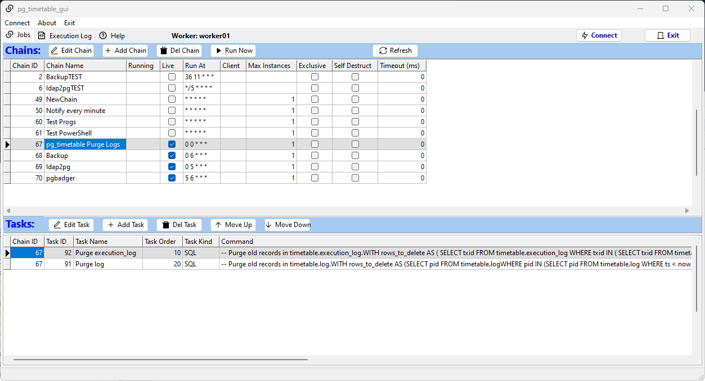
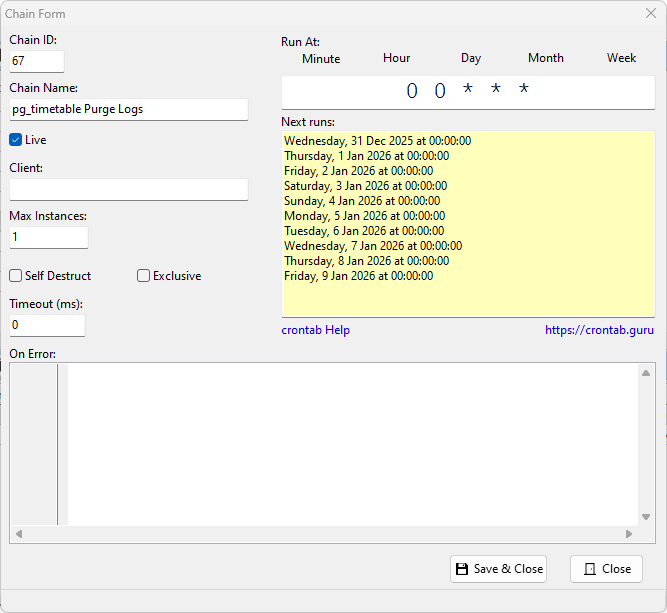
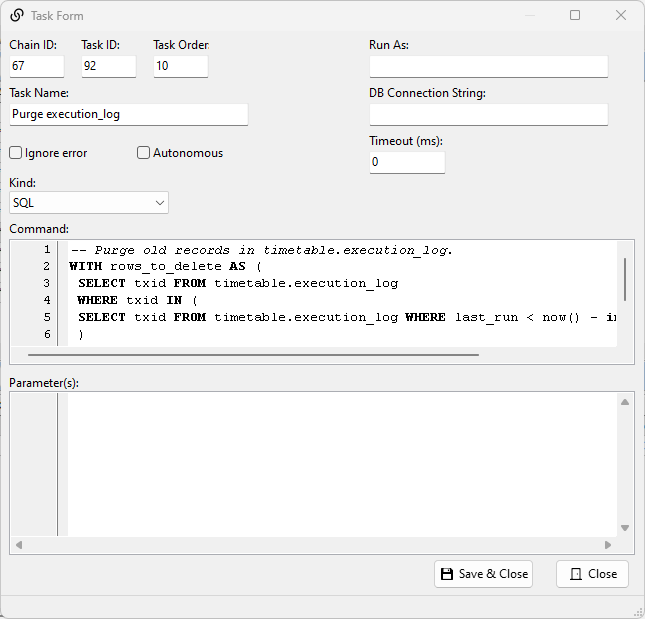

# pg_timetable_gui: IDE for [pg_timetable](https://github.com/cybertec-postgresql/pg_timetable) scheduler

**pg_timetable_gui** is a free cross-platform tool for administrators who need to work with the advanced PostgreSQL [pg_timetable](https://github.com/cybertec-postgresql/pg_timetable) scheduler.

**pg_timetable_gui** is a re-write of https://github.com/cybertec-postgresql/pg_timetable_gui

## Features
- Create/update/delete chains and tasks
- Change task order
- Run chains on demand
- Display execution history and duration
- Supports user and LDAP logins
- Syntax highlighting of SQL, command line and JSON parameters
- Supports all BUILTIN commands as of pg_timetable 6.2.0

## Compling pg_timetable_gui
You will require Lazarus https://www.lazarus-ide.org/ to compile the binary.

No extra packages are required.

The source code has been compiled and tested for the following environments:
- Windows 11 \ Windows Server 2019
- Fedora Workstation 43

## Requirements
Working pg_timetable scheduler version 6.2.0 and above running on PostgreSQL.

DLLs are required to run the binary for Windows especially libpq.dll

These DLLs can be found in the pgAdmin 4 installation typically under the path C:\Program Files\pgAdmin 4\runtime\

- d3dcompiler_47.dll
- libcrypto-3-x64.dll
- libEGL.dll
- libGLESv2.dll
- libiconv-2.dll
- libintl-8.dll
- liblz4.dll
- libpq.dll
- libssl-3-x64.dll
- libzstd.dll

Copy these DLLs to the same location as pg_timetable_gui.exe

## Support
Description of chain and task properties can be found here https://cybertec-postgresql.github.io/pg_timetable

## Credits
- Portions of code copied from original author [Pavlo Golub](https://github.com/pashagolub)
   * UpdateCronTimes
   * IsCronValueValid
   * SelectSQL 
- Media: open-source [RemixIcons](https://remixicon.com/) set
